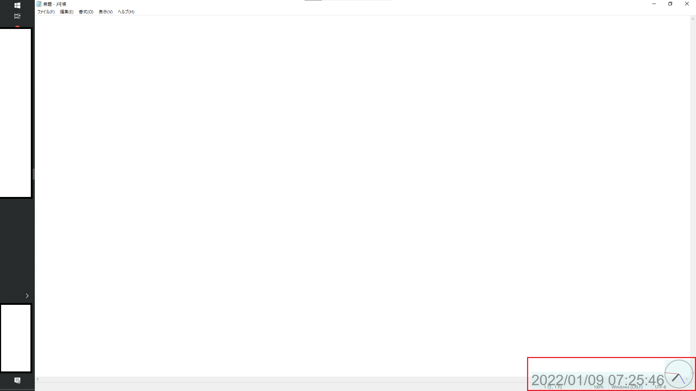

# CLOCK_CSHARP
C#で作った時計です．動作環境はwindows10となります．

下画像中の右下のもの

## 注意
現バージョンでは，タスクバーが左にあることが前提となっております．
特に，タスクバーが下・右にある場合，
時計がタスクバーにかぶる可能性があります．

また，時計サイズの決定に，ディスプレイ画面の横幅を参照しているため，
アスペクト比によっては使いづらいおおきさになる可能性があります．

なお，プログラムを使用した結果生じるいかなる損害に対しても一切責任を負いません．
ご了承ください．

## インストール
{clock_cSharp\bin\Release\net5.0-windows\publish} 
の中身のファイルを，使いやすい場所に移動してください.

clock_cSharp.exeが起動ファイルです．
こちらを起動することでプログラムが動作を始めます．
(スタートアップに登録することでPC起動と一緒に時計が立ち上がるようになります)

## 終了方法
タスクトレイ内にあるアイコンを右クリックし，終了をクリックしてください．

